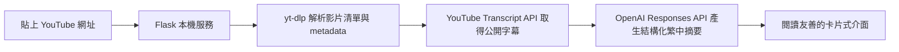

# 觀影筆記｜YouTube 繁體中文摘要 App

把 YouTube 單支影片、播放清單或頻道頁面轉成具良好閱讀層次的繁體中文摘要。貼上網址後按 Enter 或「開始整理」；頻道網址會取最新四支非直播影片。

## 使用情境

- 快速掌握長篇訪談、教學與市場分析影片
- 將同一頻道的最新內容整理成可掃讀筆記
- 保留原片連結、關鍵數字及不確定語氣，方便回看查證

## 功能

- 支援一般影片、Shorts、播放清單與頻道影片頁
- 自動排除正在直播或即將直播的項目
- 優先讀取繁體中文、中文或英文公開字幕
- 透過 OpenAI Responses API 產生結構化繁中摘要
- 響應式閱讀介面，支援滑鼠與 Enter 提交
- API Key 只在請求期間使用，不寫入磁碟

## 架構



## 專案結構

```text
.
├─ app.py                 # Flask 入口與本機啟動
├─ src/
│  ├─ youtube.py          # 網址驗證、影片探索、字幕讀取
│  └─ summarizer.py       # 提示詞、OpenAI 呼叫與結果補充
├─ static/                # CSS 與前端互動
├─ templates/             # 主介面
├─ tests/                 # 單元與 API 測試
├─ docs/                  # Medium 與作品集內容
├─ start.cmd              # Windows 雙擊啟動器
└─ requirements.txt
```

## 安裝與啟動

### Windows：雙擊啟動

1. 安裝 Python 3.11 以上版本。
2. 雙擊 `start.cmd`。第一次執行會建立 `.venv` 並安裝套件。
3. 瀏覽器會自動開啟 `http://127.0.0.1:8765`。
4. 展開「API 設定」輸入 OpenAI API Key，或先設定 `OPENAI_API_KEY`。

### 命令列

```powershell
py -3 -m venv .venv
.venv\Scripts\Activate.ps1
pip install -r requirements.txt
$env:OPENAI_API_KEY="your-key"
python app.py
```

## 使用方式

貼入以下任一格式：

```text
https://www.youtube.com/watch?v=VIDEO_ID
https://youtu.be/VIDEO_ID
https://www.youtube.com/@CHANNEL/videos
https://www.youtube.com/playlist?list=PLAYLIST_ID
```

按 Enter 或點擊「開始整理」。頻道與播放清單預設處理前四支可用影片。

## 安全與隱私模型

- 專案不包含任何 API Key、Cookie、OAuth 檔案或使用者資料。
- 介面輸入的 API Key 不存到 localStorage、檔案或資料庫，但會隨摘要請求送到本機 Flask，再由 Flask 呼叫 OpenAI。
- 本機服務只監聽 `127.0.0.1`，不對區域網路公開。
- 字幕與影片資訊會傳給 OpenAI 產生摘要；不適合處理機密或未授權內容。
- 只讀取 YouTube 提供的公開字幕，不下載影音檔。

## 測試

```powershell
pip install pytest
pytest -q
python -m compileall app.py src tests
```

測試涵蓋健康檢查、輸入驗證、API Key 缺漏、成功回應、YouTube 網址解析及非 YouTube 網址拒絕。

## 限制

- 沒有公開字幕、私人影片、地區限制或 YouTube 阻擋時無法摘要。
- 頻道頁解析依賴 YouTube 目前的公開頁面格式；上游改版後可能需要更新 `yt-dlp`。
- AI 摘要可能遺漏或誤解內容，重要數字與投資資訊必須回看原片。
- 大量影片會產生 OpenAI API 成本。

## 實作心得與後續方向

真正困難的不是呼叫模型，而是把「網址種類、直播排除、字幕語言、錯誤回饋、秘密資料」變成穩定的產品邊界。未來可加入字幕快取、摘要匯出、模型與影片數量設定、時間戳引用，以及完全本機模型模式。

## License

[MIT](LICENSE)
