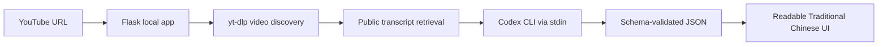

# YouTube Summary App

A Windows-friendly local app that turns a YouTube video, playlist, or a channel's latest four non-live uploads into readable Traditional Chinese notes.

The repository contains two complete implementations:

- **`codex-cli/` recommended:** no OpenAI API key. It uses Codex CLI and the user's ChatGPT account.
- **`legacy-api/` archived:** the original OpenAI API version for users who prefer usage-based API billing.

## Project overview

The app started as a conventional API-key summarizer and became a developer-experience project. The core product question was not only "Can a model summarize a transcript?" It was "Can another person clone this repository, launch it on Windows, authenticate with the account they already use, and get a useful result without copying secrets into the app?"

The recommended implementation uses Codex CLI as the model access boundary. The Flask app remains responsible for YouTube discovery, transcript retrieval, schema validation, and presentation. Codex handles the model call through its own authenticated CLI session.

## What this demonstrates

- Product thinking around first-run onboarding and account boundaries.
- Defensive handling of untrusted transcript text.
- Windows-specific executable discovery for Codex CLI.
- Clean-clone reproducibility checks instead of relying on a warm development folder.
- Separation between a recommended keyless implementation and an archived API-key implementation.

## Use cases

- Scan long interviews, tutorials, and market commentary before deciding what to watch.
- Review a creator's latest four uploads while excluding live and upcoming streams.
- Preserve important numbers, uncertainty, and links back to the original videos.

## Recommended features

- One-click Windows setup through `codex-cli/start.cmd`
- ChatGPT browser sign-in via official Codex CLI; no API key field
- Video, Shorts, playlist, and channel URL support
- Public transcript discovery in Traditional Chinese, Chinese, or English
- Structured output with overview, per-video summary, key points, and takeaway
- Responsive Traditional Chinese reading interface
- Read-only, ephemeral Codex execution with a JSON output schema

## Architecture



The fixed summarization instruction is passed as the `codex exec` prompt. Transcript JSON arrives through stdin as untrusted context. Codex runs with `--sandbox read-only`, `--ephemeral`, `--ignore-user-config`, and `--ignore-rules`.

## Folder tree

```text
.
|-- codex-cli/             # Recommended, ChatGPT-authenticated version
|   |-- app.py
|   |-- start.cmd          # Setup, login, and launch
|   |-- summary-schema.json
|   |-- src/
|   |-- static/
|   |-- templates/
|   `-- tests/
|-- legacy-api/            # Original API-key version
|-- docs/
|   |-- medium-article.md
|   `-- portfolio.md
|-- LICENSE
`-- README.md
```

## Fastest Windows setup

Prerequisites:

1. A ChatGPT plan/workspace with Codex access.
2. Python 3.11 or newer.
3. Node.js LTS only when Codex CLI is not already available.

Then:

1. Download or clone this repository.
2. Open `codex-cli`.
3. Double-click `start.cmd`.
4. On the first run, complete the browser-based ChatGPT sign-in.
5. Paste a YouTube URL and press Enter.

The launcher creates a private Python environment, installs dependencies, detects a working Codex executable, installs the official `@openai/codex` package if necessary, checks login status, and starts the local interface.

## Command-line setup

```powershell
git clone https://github.com/phyop/YT_Summary_App.git
cd YT_Summary_App\codex-cli
py -3 -m venv .venv
.venv\Scripts\python.exe -m pip install -r requirements.txt
npm install -g @openai/codex
codex login
.venv\Scripts\python.exe app.py
```

If the Microsoft Store Codex executable shadows the npm CLI on Windows, the launcher automatically prefers `%APPDATA%\npm\codex.cmd`. Advanced users may set `CODEX_CLI_PATH` to a known working executable.

## Safety model

- The recommended version stores no API keys.
- Codex CLI owns authentication and caches credentials in its normal OS credential location. This repository never reads or copies those credentials.
- Transcript text is sent to Codex/OpenAI under the signed-in user's Codex entitlement.
- The local server listens only on `127.0.0.1`.
- Codex runs in read-only, ephemeral mode and receives a schema-constrained task.
- Transcript content is explicitly treated as untrusted data, not instructions.
- Credentials, virtual environments, caches, and runtime output are ignored by Git.

## Validation

```powershell
cd codex-cli
python -m pytest -q
python -m compileall app.py src tests
```

Validation includes URL parsing, unavailable-executable fallback, ChatGPT login detection, Flask API behavior, real channel discovery, real transcript retrieval, a live `codex exec` structured-output run, desktop/mobile UI checks, secret scanning, and a clean-clone setup simulation.

## Reproducibility notes

The app cannot remove every external dependency: users still need Python, internet access, a YouTube video with public transcripts, and ChatGPT Codex access. The launcher turns the remaining setup into one guided entry point and prints actionable errors when a prerequisite is missing.

YouTube may change its public page format. The project pins a tested `yt-dlp` version; update it when upstream extraction changes.

## Lessons learned

The first version made model access easy for developers but awkward for Plus users without API keys. Codex CLI solved the entitlement problem, while introducing a different engineering challenge: executable discovery on Windows. The robust solution is to test candidates rather than trust `PATH`, prefer the npm shim when available, and keep authentication inside the official CLI.

## Future improvements

- Timestamp citations for every key point
- Markdown and PDF exports
- Transcript/result caching
- macOS and Linux launch scripts
- Optional local-model backend

## License

[MIT](LICENSE)
